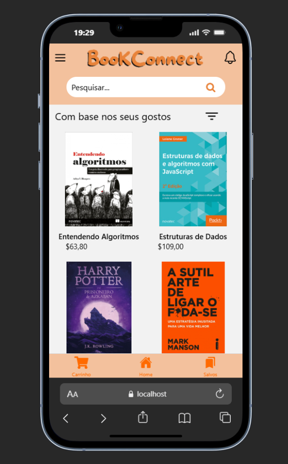
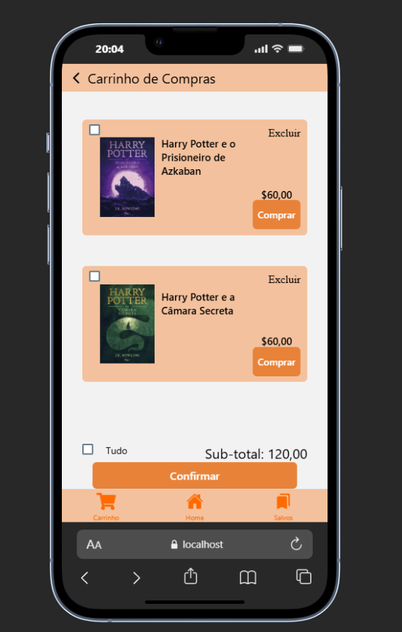
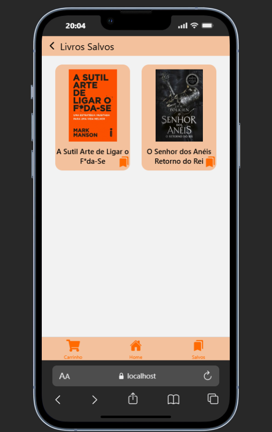
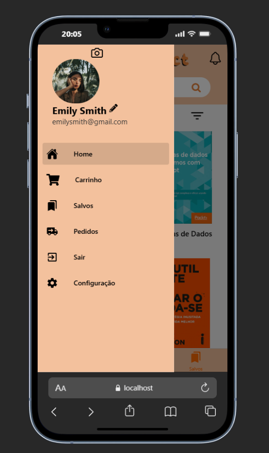
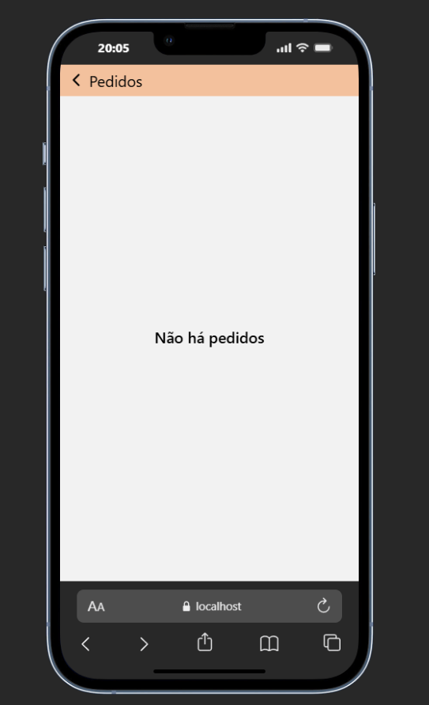
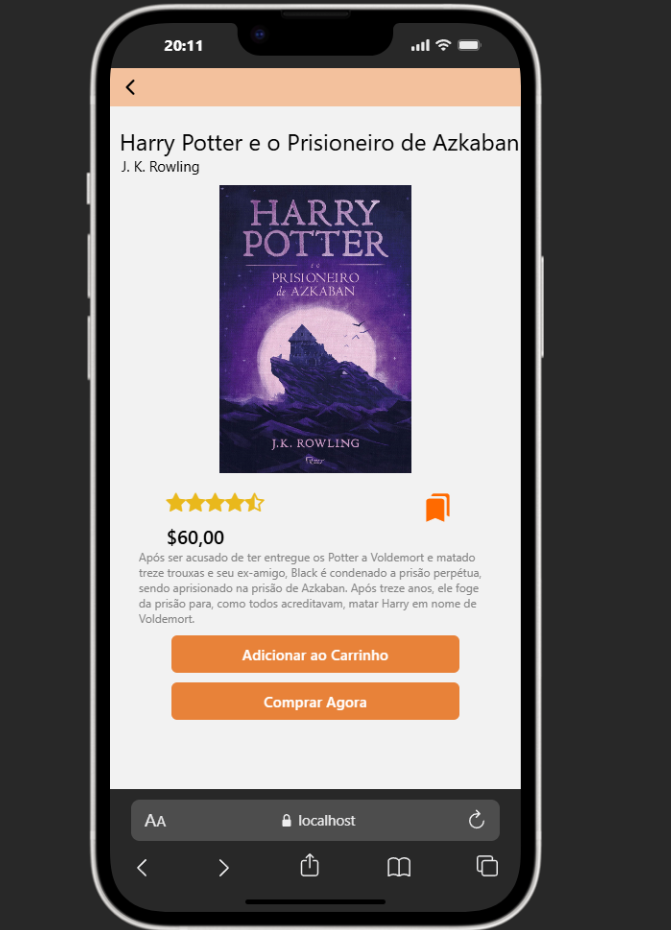

# 📚 Book Connect

> Meu primeiro projeto com **React Native** 🚀  
> Um aplicativo focado em **vendas de livros**.  

---

## 📸 Preview


---

## ⚡️ Pré-requisitos

Antes de rodar o projeto, certifique-se de ter instalado:

- [Node.js](https://nodejs.org/)  
- [npm](https://www.npmjs.com/)  
- [React Native](https://reactnative.dev/) configurado  

Além disso, instale a extensão no seu Chrome para rodar no navegador:

👉 [React Native for Web (WebMobileFirst)](https://www.webmobilefirst.com/en/)

---

## 🚀 Como rodar o projeto

Clone o repositório e entre na pasta:

```bash
git clone https://github.com/SEU-USUARIO/book-connect.git

```
cd book-connect


## Instale as dependências:

```bash
npm install
```

## Inicie o projeto:

```bash
npm start
```

## Quando o terminal abrir, pressione a tecla:

W


Isso vai abrir o projeto direto no navegador 🌐

## Primeiramente vc clica nesta extensão instalamos anteriormente


## Aqui esta alguns prints do App caso não queira rodar no seu PC






